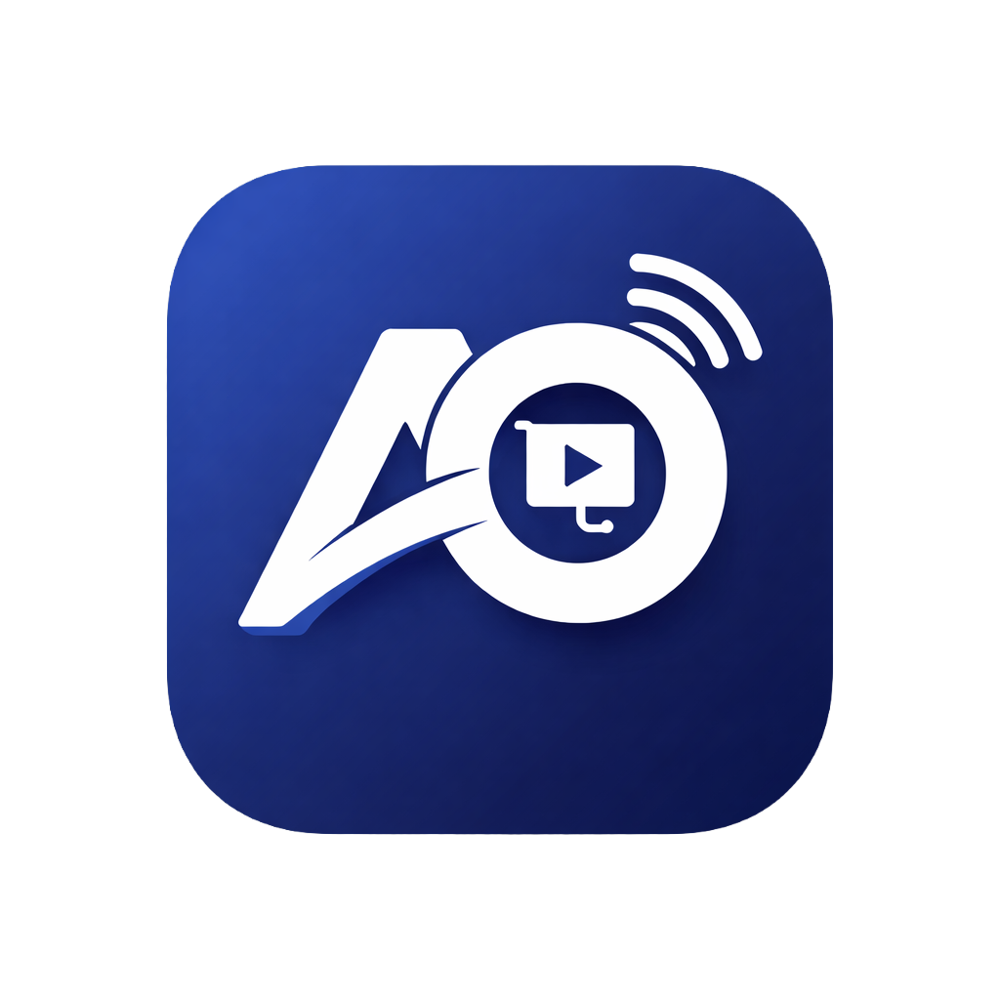

  
   
  <h1> 🚀 Abiso Clicker Pro V3.0 </h1>
  <h3>Ditch the USB Dongle. Command the Stage.</h3>
  
  

    <b>Turn your Android phone into an elite presentation command center. Seamlessly control PowerPoint, Canva, and Google Slides with zero-lag.</b>
  

  <!-- Badges for a professional look -->
  
  
  

   
   

> **🎉 V3.0 FOUNDER'S EDITION (EARLY ACCESS)**  
> Legacy hardware clickers cost ₱6,000+ ($100+) and only have 3 buttons. While we prepare for our broader App Store rollout, we are offering early adopters the **Lifetime Pro License for just ₱699 / $14.99.**  
> *⚠️ Strictly limited to the first 1,000 early adopters. Avoid future subscriptions by locking in your license today.*

> **🎁 TEST ON STAGE. ZERO RISK.**  
> Every account automatically gets **7 Full Presentation Sessions for FREE**. No ticking 7-day clocks. No credit card required. Use the 144Hz laser, read your notes, and test the Canva bridge on stage. 

---

### 📥 Quick Downloads (4-Component Suite)

Get the official binaries below. To run Abiso Clicker Pro, you need the Windows Host and the Android App. For web decks, add the Edge Extension.

| Component | Platform | Role | Download Link |
| :--- | :--- | :--- | :--- |
| 💻 **Host Server** | Windows 10/11 | Core presentation server. Includes PowerPoint Media Bridge. | [**Download All-in-One (.exe)**](https://github.com/abisosolutions/Abiso-Clicker-Pro-Distribution/releases/latest/download/Abiso_Clicker_Pro_Host_Setup_v3.exe) Or get from [Microsoft Store](https://apps.microsoft.com/detail/9MZBPGMQS55P) |
| 📱 **Controller App** | Android 8.0+ | Master stage remote | [**Download App (.apk)**](https://github.com/abisosolutions/Abiso-Clicker-Pro-Distribution/releases/latest/download/Abiso_Clicker_Pro_v3.apk) |
| 🌐 **Edge Bridge** | Microsoft Edge | Canva & Google Slides integration | [**Get Edge Add-on**](https://microsoftedge.microsoft.com/addons/detail/ajcghecbgeinlcilkclniljojjcfmofm) |
| 🔌 **PPT Media Bridge** | Microsoft PowerPoint | Background video/audio control | [**Download Add-in (.exe)**](https://github.com/abisosolutions/Abiso-Clicker-Pro-Distribution/releases/latest/download/Abiso-PowerPoint-Bridge-Setup.exe) *(Required ONLY for MS Store users)* |

---

### 🎬 See It In Action (Video Tutorials)
- [**Part 1: Quick Setup & Connection**](https://www.youtube.com/watch?v=N2gp8qbHuFg)
- [**Part 2: Pro Features (Laser, Spotlight, Zoom)**](https://www.youtube.com/watch?v=1a6LwkAQZr4)
- [**Part 3: Live Control & Canva Bridge**](https://www.youtube.com/watch?v=z2J7FLTe3Xc)

---

### ✨ The Stage Arsenal (V3.0 Features)

Abiso Clicker Pro isn't just a remote—it's a full production suite designed for professional trainers, educators, and executives:

1. ⚡ **0ms Slide Navigation:** Instant hardware-level key injection for next/previous slides, plus instant jumping via the thumbnail grid.
2. 📱 **Teleprompter & Live Preview:** Read your secret speaker notes right on your phone while the audience only sees the slides. Includes silent haptic pacing alerts.
3. 🔴 **144Hz Vector Laser & Avatars:** A buttery-smooth digital laser that renders perfectly on projectors. Use Butterflies, Wands, Birds, Dots, or Custom Logos.
4. 🔦 **Spotlight Focus Beams:** Dim the entire room's screen and highlight specific data points using fully adjustable circular or rectangular spotlight beams.
5. 🔍 **High-DPI Vector Magnifier:** Zoom into fine-print diagrams up to 5&times; with razor-sharp PDF vector lens rendering and live touch panning.
6. ⬛ **Stage Covers & Watermarks:** Instantly blank the projector with a clean Black screen, a bright White screen, or display your custom Brand Logo watermark.
7. 🌐 **The Edge Web Bridge:** Abiso natively intercepts **Canva and Google Slides** directly from Microsoft Edge. No manual downloading required.
8. ☕ **Master Timers & BGM:** Project a beautiful countdown timer on the big screen during breaks, complete with built-in Lo-Fi background music and alarm chimes.
9. 🎲 **Random Audience Picker:** Run live Q&A sessions or raffles directly on the projector screen with an animated spinner and a 'Never Repeat' memory pool.
10. 📊 **Post-Show PDF Analytics:** Automatically generates a beautiful PDF report detailing your slide pacing, total duration, and audience engagement metrics.
11. 🔊 **System Media Remote & PPT Bridge:** Control laptop volume and mute remotely. For PowerPoint decks containing embedded videos, the lightweight Media Bridge Add-in gives you 0ms background Play/Pause control without needing mouse clicks or taking focus away from your slides.
12. 🛡️ **Stage-Rescue Failover:** Corporate WiFi blocking your connection? Our 5-Second Mobile Hotspot failover ensures you never lose control on stage.

---

### 🛡️ Direct Release & Privacy Guarantee

We distribute directly to our early adopters while maintaining official listings on the Microsoft Store. Radical transparency from day one:

1. **Certified Store Listing:** Abiso Clicker Pro Host is officially vetted and available on the **[Microsoft Store](https://apps.microsoft.com/detail/9MZBPGMQS55P)**.
2. **No Invasive Permissions:** Because we use modern Android Scoped Storage and Local WiFi APIs, we **never** ask for your Contacts, Storage, or Location.
3. **100% Local Processing:** Your presentation files never leave your local WiFi network. No cloud processing is involved in your slideshows.
4. **Verify Before Installing:** We actively encourage you to upload our `.exe` and `.apk` files to **[VirusTotal](https://www.virustotal.com/)** to verify our clean file hashes before installing.

---

### 🛠️ 3-Minute Setup Guide

1. **Install the Host:** 
   * **Option A:** Run `Abiso_Clicker_Pro_Host_Setup_v3.exe` on your Windows laptop. *(Auto-bundles the PPT Media Bridge).*
   * **Option B:** Install via the [Microsoft Store](https://apps.microsoft.com/detail/9MZBPGMQS55P). *(Requires separate download of `Abiso-PowerPoint-Bridge-Setup.exe` for video control).*
2. **Install the App:** Download and install the `Abiso_Clicker_Pro_v3.apk` on your Android phone.
3. **Connect Your Phone:** Ensure both devices are on the same WiFi. Open the Android app, tap the **QR Scanner**, and scan the code on your laptop screen.
4. **Web Presentations (Optional):** If presenting via Canva or Google Slides, install the **Edge extension**, open your deck, and press **Windows + P → Extend**.

---

### 💡 Stage-Rescue: Corporate WiFi Blocking You?
Public/Corporate WiFi networks often block device-to-device connections (AP Isolation). To bypass this instantly:
1. Turn on **Mobile Hotspot** on your Windows laptop.
2. Connect your Android phone's WiFi to the laptop's hotspot.
3. The IP address in the Abiso Host window will update automatically. Scan the new QR code. 
*This creates an unblockable, ultra-low latency direct link between your phone and laptop!*

---

  
<b>ABISO CLICKER PRO</b>

  
<i>Professional Tools for Professional Speakers</i>

  <a href="mailto:abisosolutions@gmail.com">Contact Support</a> • <a href="https://abisosolutions.github.io/Abiso-Clicker-Pro-Distribution/">Official Website</a>

